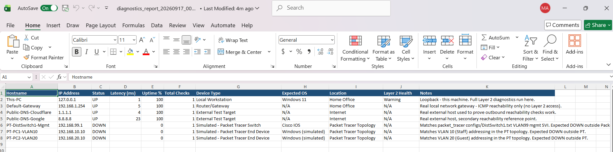

# Network & Device Diagnostics Toolkit

A three-layer IT diagnostics toolkit. Python checks whether devices are reachable on the network. PowerShell checks whether a device is actually healthy. Excel ties both to a device inventory and a combined report. A Cisco Packet Tracer topology adds switch and VLAN configuration on top.

## What it looks like

Console dashboard from a real run of `python -m integration.run_diagnostics`:

```
Loaded 7 devices from inventory.

Running Layer 1 network reachability checks...
  [Layer 2] Running device diagnostics for 'This-PC' (local host)...

STATUS  HOSTNAME               IP ADDRESS     LATENCY  UPTIME%  CHECKS  LAYER 2 SUMMARY
------  ---------------------  -------------  -------  -------  ------  ----------------------
UP      This-PC                127.0.0.1      1.0 ms   100.0%   1       Warning (1 warning(s))
UP      Default-Gateway        192.168.1.254  3.0 ms   100.0%   1       -
UP      Public-DNS-Cloudflare  1.1.1.1        6.0 ms   100.0%   1       -
UP      Public-DNS-Google      8.8.8.8        24.0 ms  100.0%   1       -
DOWN    PT-DistSwitch1-Mgmt    192.168.99.1   -        0.0%     1       -
DOWN    PT-PC1-VLAN10          192.168.10.10  -        0.0%     1       -
DOWN    PT-PC2-VLAN20          192.168.20.10  -        0.0%     1       -

4/7 devices UP

Combined report written to: reports/diagnostics_report_20260917_003102.xlsx
```

The `PT-*` rows show DOWN because those addresses belong to the Packet Tracer topology, which isn't bridged to this machine's network — see [Architecture](#architecture).

Excel report:



*(screenshot not yet added — see [Screenshots still needed](#screenshots-still-needed))*

## Tech stack

| Tool | What it does here |
|------|--------------------|
| **Python** | Runs the Layer 1 reachability checks, uptime logging, dashboard rendering, and orchestrates Layer 2/3. |
| **PowerShell** | Pulls real device info (`Get-ComputerInfo`, `Get-CimInstance`) and runs a real printer test-page job (`Win32_Printer.PrintTestPage`) plus peripheral enumeration (`Get-PnpDevice`). |
| **TCP/IP** | Real ICMP pings (via the OS `ping` binary) and real TCP socket connects (`socket.create_connection`). See `layer1_network_monitor/network_scanner.py`. |
| **Cisco Packet Tracer** | A 3-switch, 2-VLAN topology with inter-VLAN routing and a segmentation ACL. See `packet_tracer/`. |
| **Excel** | Real `.xlsx` read (device inventory) and write (combined status report) via `openpyxl`. |

## Architecture

```
inventory/device_inventory.xlsx
            │  (Layer 3 import)
            ▼
┌───────────────────────────┐
│ integration/run_diagnostics.py │
└─────────────┬─────────────┘
              │
   ┌──────────┴───────────┐
   ▼                       ▼
Layer 1 (Python)      Layer 2 (PowerShell, local host only)
- ICMP ping / TCP      - Get-DeviceInfo.ps1
  socket checks        - Test-PrinterPeripheral.ps1
- SQLite uptime log    - Invoke-DeviceDiagnostics.ps1 (orchestrator)
- Console dashboard      → JSON on stdout, parsed by Python
   │                       │
   └──────────┬────────────┘
              ▼
   reports/diagnostics_report_<timestamp>.xlsx
   (Layer 3 export — Network Status + Device Diagnostics sheets)
```

For every device in the inventory, Layer 1 runs a real reachability check. Any device flagged `IsLocalHost=True` (by default, just the machine running the toolkit) also gets the full Layer 2 PowerShell diagnostic run against it. Both results land in the same dashboard row and the same report.

The sample inventory (`inventory/device_inventory.xlsx`) mixes two kinds of rows: real, reachable targets (`127.0.0.1`, the local network's gateway, public DNS resolvers), and addresses matching the Packet Tracer topology (`192.168.10.x`, `192.168.20.x`, `192.168.99.x` — see `packet_tracer/topology_diagram.md`). The Packet Tracer addresses show DOWN when the toolkit runs outside Packet Tracer, since Packet Tracer's simulated network isn't bridged to the host machine's NIC. They're included so the inventory mirrors the Cisco topology's addressing scheme; the Python tool does not reach into the simulator.

## Features

**Layer 1 — network monitoring** (`layer1_network_monitor/`)
- Real ICMP ping checks (shells out to the OS `ping` binary, parses round-trip time)
- Real TCP socket checks, used as a fallback when a port is specified
- Uptime/downtime history logged to SQLite, uptime % computed from accumulated checks
- Console dashboard showing live status, latency, uptime %, and a Layer 2 health summary per device

**Layer 2 — device diagnostics** (`layer2_device_diagnostics/`)
- `Get-DeviceInfo.ps1` — OS, version, architecture, manufacturer, model, CPU, memory, per-disk free space, installed software, last boot time
- `Test-PrinterPeripheral.ps1` — enumerates installed printers, submits a real test-page spool job via `Win32_Printer.PrintTestPage`, reports live printer status and queue depth, enumerates USB peripherals
- `Invoke-DeviceDiagnostics.ps1` — orchestrates both scripts and applies threshold-based health rules (disk/memory free-space bands, non-normal printer status) to produce a Healthy/Warning/Critical verdict

**Layer 3 — Excel inventory and reporting** (`layer3_excel_io/`, `inventory/`)
- Imports the device inventory from a `.xlsx` file
- Exports a combined `.xlsx` report after each run, with a Network Status sheet and a Device Diagnostics sheet, merged per device

**Integration**
- Local-host devices get both layers joined in the dashboard and report

**Cisco Packet Tracer** (`packet_tracer/`)
- Topology design and addressing scheme: 3 switches, 2 VLANs plus a management VLAN, inter-VLAN routing, a segmentation ACL
- Cisco IOS configuration commands for all three switches
- Saved Packet Tracer project (`network-topology.pkz`)
- `show running-config` output captured from all three switches
- VLAN reachability tested with ping between hosts in the topology

## What was verified

Run for real on a Windows 11 machine during development, not just written and assumed to work:

- `Get-ComputerInfo`, `Get-CimInstance` (`Win32_OperatingSystem`, `Win32_ComputerSystem`, `Win32_Processor`, `Win32_LogicalDisk`, `Win32_PhysicalMemory`) — returned real hardware data.
- `Get-Printer`, `Get-PrintJob`, `Get-PnpDevice` — ran against a real installed printer and correctly detected and reported it as Offline.
- `Win32_Printer.PrintTestPage` via `Invoke-CimMethod` — confirmed the method exists on this system's WMI class.
- The full `python -m integration.run_diagnostics` pipeline was run end-to-end: loaded the sample inventory, pinged real local/public hosts, correctly showed the Packet-Tracer-only addresses as unreachable, ran the PowerShell diagnostics subprocess, parsed its JSON, logged everything to SQLite, printed the dashboard, and wrote a readable `.xlsx` report with both sheets populated.

## Running it

```powershell
pip install -r requirements.txt

# (optional) regenerate the sample inventory
python inventory/generate_sample_inventory.py

# run a full monitoring pass (dashboard + Excel report)
python -m integration.run_diagnostics

# actually submit a physical test page to installed printers (off by default)
python -m integration.run_diagnostics --run-printer-test

# point at your own inventory file
python -m integration.run_diagnostics --inventory path\to\your_inventory.xlsx
```

Output:
- Console dashboard of all devices' current status
- `logs/uptime_history.db` — SQLite history (gitignored, machine-specific)
- `reports/diagnostics_report_<timestamp>.xlsx` — combined report (gitignored, machine-specific)

## Repo structure

```
inventory/                    Layer 3 sample input (.xlsx) + generator script
layer1_network_monitor/       Python — ping/TCP checks, uptime log, dashboard
layer2_device_diagnostics/    PowerShell — device info, printer/peripheral tests
layer3_excel_io/              Python — .xlsx import/export
integration/                  Main entry point tying all three layers together
packet_tracer/                Topology, Cisco IOS configs, running-config exports
```

## Scope and limitations

- This is a simulated network built in Cisco Packet Tracer, not real hardware.
- Layer 2 diagnostics run against the local machine by default. PowerShell Remoting (`Invoke-Command -ComputerName`) would extend this to other machines, but that requires WinRM trust configuration between machines that wasn't tested here.

## Screenshots still needed

- **`docs/screenshots/excel-report.png`** — referenced in [What it looks like](#what-it-looks-like), not yet in the repo. To add it:
  1. Run `python -m integration.run_diagnostics`.
  2. Open the generated `reports/diagnostics_report_<timestamp>.xlsx` in Excel.
  3. Screenshot the "Network Status (Layer 1)" sheet (include "Device Diagnostics (Layer 2)" too if it fits).
  4. Save it as `docs/screenshots/excel-report.png` in the repo root. The image reference already in the README will pick it up once the file exists.
